# Jackut - Sistema de Rede Social (POO/UFAL)

## 📁 Estrutura do Projeto

Parte 1 :

Parte 2 :


## 📄 Documentação Técnica

### Relatórios:
- **relatorio-milestone1.pdf**
- **relatorio-milestone2.pdf**

Arquivos pdf disponível na raiz do projeto descrevendo o design, explicando escolhas e inclunindo o diagrama de classes.

## 🚀 Milestone 2 - Novas Funcionalidades
### Comunidades & Relacionamentos Avançados
- **Criação de Comunidades**  
  Usuários podem criar comunidades com nome único e descrição
- **Membros & Mensagens Coletivas**  
  Adição de membros e envio de mensagens para toda a comunidade
- **Novos Tipos de Relacionamentos**
    - 🎭 Fã-Ídolo (relação pública unidirecional)
    - 💘 Paquera (relação privada com notificação mútua)
    - ⚔️ Inimizade (bloqueio de interações)
- **Gestão de Conta**  
  Remoção completa de usuários com limpeza de dados relacionados

### User Stories Implementadas
| US  | Descrição                                        | Status     |
|-----|--------------------------------------------------|------------|
| 5   | Criação e gestão de comunidades                 | ✅ Completa|
| 6   | Adição de membros às comunidades                | ✅ Completa|
| 7   | Mensagens para comunidades                      | ✅ Completa|
| 8   | Relacionamentos complexos (fã/paquera/inimigo)  | ✅ Completa|
| 9   | Remoção de conta com limpeza de dados           | ✅ Completa|


### Javadoc:
A documentação completa estará disponível em:
```
docs/
├── index.html
├── overview-tree.html
└── (demais arquivos de documentação)
```

## 🏗️ Principais Componentes

### 📌 Pacote de Exceções (`exceptions/`)
### 📌 Entidades Principais (`models/`)
### 📌 Gerenciadores (`services/`)

## 🎓 Contexto Acadêmico

**Disciplina**: Programação 2 - POO

**Instituição**: UFAL - IC

**Competências Desenvolvidas**:
- Implementação de hierarquia de exceções
- Serialização de objetos Java
- Padrão Facade para interface simplificada
- Testes automatizados com EasyAccept

## ⚙️ Configuração Recomendada

1. **IDE**: IntelliJ IDEA (compatível com arquivo .iml)
2. **JDK**: Versão 17 ou superior
3. **Persistência**: Arquivo `dados_jackut.dat` (criado automaticamente)

---
